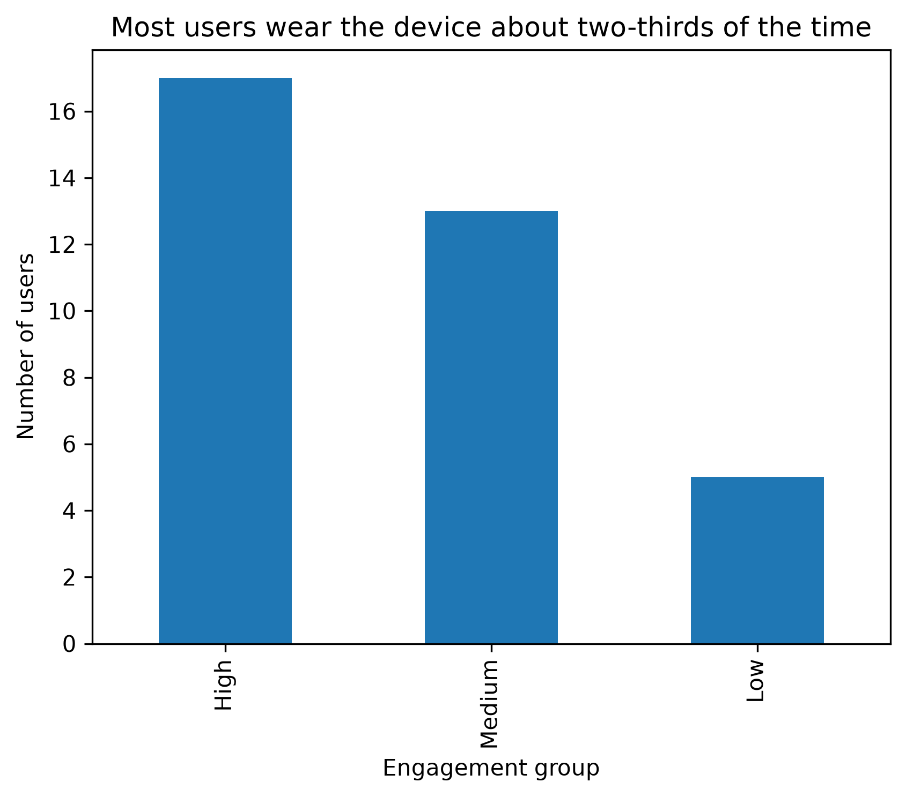
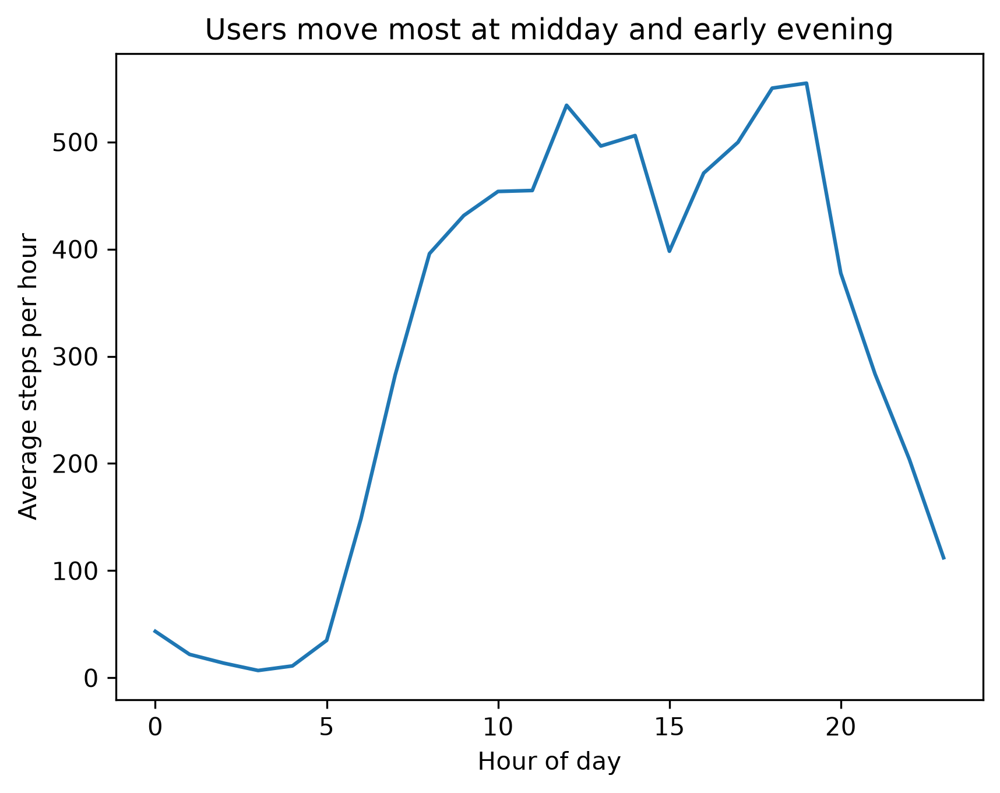
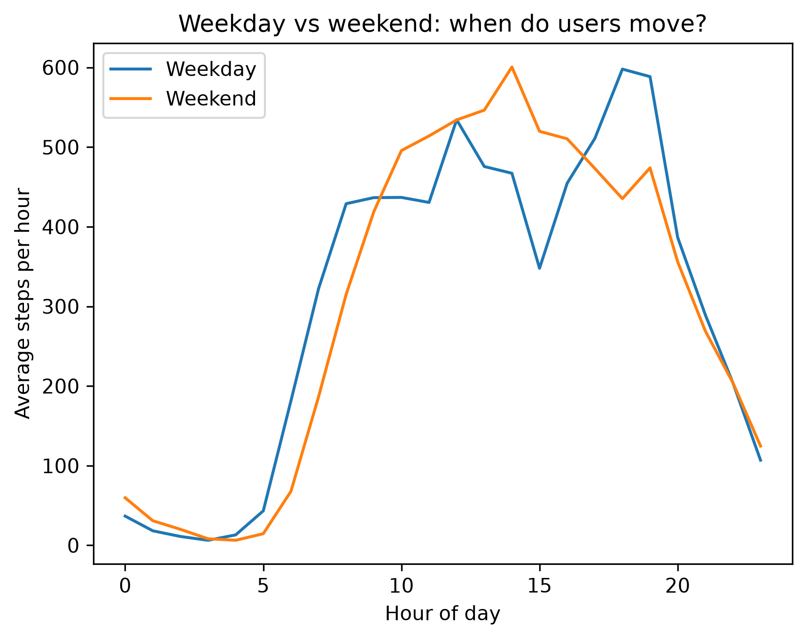
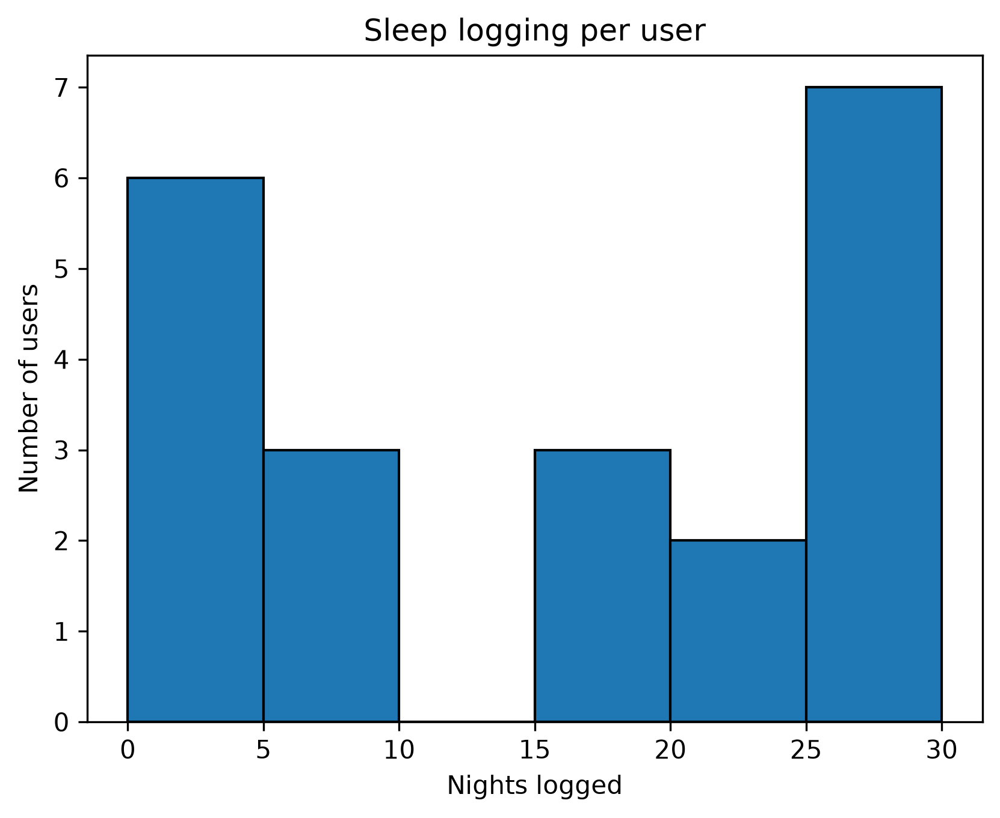
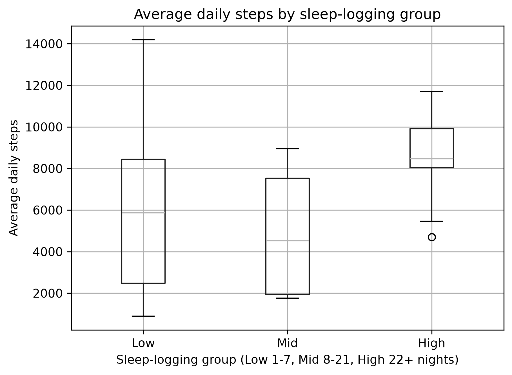

# Bellabeat Case Study: What Fitness-Tracker Habits Say About Engagement

*A consumer-insights analysis of 35 smart-device users, built with Python, pandas, Matplotlib, and Power BI.*

📊 [Dashboard (PDF)](Dashboard/Bellabeat_Dashboard.pdf) · 📓 [Analysis notebook](notebooks/Bellabeat_Notebook.ipynb)

## Overview

This case study uses Fitbit activity and sleep data as a proxy to explore questions relevant to Bellabeat membership behavior. It examines recording coverage, weekday and weekend activity, peak activity hours, and the relationship between sleep and activity.

Fitbit users are not Bellabeat members, so these findings may not represent Bellabeat customers.

## Key takeaways

- Device wear was inconsistent. The most engaged user wore the device on 79% of days, while most users were near two-thirds.
- Activity peaked around midday and again at 6–7 p.m., with a dip around 3 p.m. Weekend activity showed a broader afternoon peak and a later start.
- Sleep tracking varied. Of 35 users, 24 logged sleep; they tended to be either frequent or infrequent loggers.
- Frequent sleep loggers also recorded more steps: their median was about 8,460 daily steps, compared with about 5,860 for light loggers. This is an association in a small sample and may reflect overall device engagement rather than a relationship between sleep and activity.

## 1. Business task

Bellabeat is a wellness-technology company focused on women's health. This analysis explores how people use a smart tracker day to day and what those patterns may suggest for marketing Bellabeat's app and wearables.

## Key stakeholders

- **Urška Sršen, cofounder and Chief Creative Officer** 
- **Sando Mur, cofounder and executive team member** 
- **Bellabeat Marketing Analytics Team**
**Guiding question:** Which usage patterns could shape engagement and messaging strategies?

## 2. Data

The analysis uses public Fitbit tracker data from Kaggle, covering March 12 to May 12, 2016 (62 days).

| Table | Level of detail | Time window | Users |
|---|---|---:|---:|
| Daily activity | User × day | 62 days | 35 |
| Hourly steps | User × hour | 62 days | 35 |
| Sleep | User × night | April 12–May 12 (31 days) | 24 |

Activity and hourly steps were each provided in two files, one for each collection period. The files were combined for analysis.

## 3. Data cleaning

| Step | Result |
|---|---|
| Combined split files | 1,397 activity rows; 46,183 hourly-step rows |
| Standardized column names | Converted column names to lowercase across all tables |
| Removed duplicates | 24 activity, 3 sleep, and 175 hourly-step rows |
| Checked for missing values | None found in any table |
| Parsed dates | Converted sleep and hourly timestamps to datetime |
| Verified user IDs | All 35 users appeared in both activity and steps data |

**Coverage note:** Sleep data covers only the second half of the study period. Comparisons involving sleep were restricted to April 12–May 12 so that the data sources covered the same dates.

## 4. Analysis

### 4.1 How engaged are users?

A day counted as “worn” if it had any steps or fewer than 1,440 sedentary minutes. A day with zero steps and a full 1,440 sedentary minutes may indicate that the device was sitting on a shelf.

The share of days worn per user was:

- **Mean:** 57.5%
- **Median:** 64.5%
- **Maximum:** 79%

Two users recorded almost nothing, with fewer than 10 days of data.

Users were grouped by the share of days worn:

| Engagement group | Share of days worn | Users |
|---|---:|---:|
| High | Over 65% | 17 |
| Medium | 45–65% | 13 |
| Low | Under 45% | 5 |

These cut-offs are judgment calls, not natural breaks in the data.

### 4.2 What does everyday movement look like?

On days when the device was worn, the average user recorded about 949 sedentary minutes, 203 lightly active minutes, 15 fairly active minutes, and 22 very active minutes.

Most worn days were close to full-day recordings: 97% logged at least 10 hours, and 88% logged at least 15 hours.

| Engagement group | Sedentary minutes | Lightly active minutes | Fairly active minutes | Very active minutes |
|---|---:|---:|---:|---:|
| Low | 1,192 | 108 | 26 | 13 |
| Medium | 991 | 209 | 13 | 17 |
| High | 899 | 210 | 15 | 25 |

Low-engagement users had very high sedentary time and little light activity. Some of this may reflect partial wear, since the device records “sedentary” by default, so interpret the Low group with caution.

### 4.3 When are users active?

Activity followed a two-peak daily pattern: a midday peak around 12–2 p.m. and a higher evening peak around 6–7 p.m. There was a short dip around 3 p.m. and near-zero movement from 1–4 a.m.

Activity rises in the morning on both weekdays and weekends. Weekend activity peaks earlier in the afternoon, while weekday activity reaches its highest point in the early evening

### 4.4 Sleep tracking and activity

Twenty-four of the 35 users (69%) logged sleep. Nights logged per user averaged 17.1, with a median of 20.5 and a range of 1–31. The distribution was U-shaped: many users logged sleep nearly every night, while another cluster logged it only occasionally.

Sleep logging varied: several users logged sleep on only a few nights, while another group logged it on 25–30 nights.

Loggers were grouped by nights recorded. Average daily steps were compared over the shared April 12–May 12 period.

| Sleep-logging group | Nights logged | Users | Mean daily steps | Median daily steps |
|---|---:|---:|---:|---:|
| Low | 1–7 | 8 | 6,289 | 5,861 |
| Mid | 8–21 | 4 | 4,941 | 4,519 |
| High | 22 or more | 12 | 8,575 | 8,463 |

Users in the High sleep-logging group had a higher median daily step count than users in the Low and Mid groups. The Low group also showed a wider spread in step counts. This describes an association in the Fitbit proxy data; it does not show that logging sleep caused users to walk more.

The Mid group includes only four users, so it is reported but not interpreted.
### Analysis notebook

Explore the full analysis in the [analysis notebook](notebooks/Bellabeat_Notebook.ipynb).

### Power BI dashboard

I rebuilt the key findings as a Power BI dashboard so the engagement story can be read at a glance: engagement groups, how the day is spent, hourly activity on weekdays vs. weekends.

[📄 Open the full dashboard (PDF)](Dashboard/Bellabeat_Dashboard.pdf)

## 5. Recommendations

1. **Treat the wear habit as a core engagement challenge.** No user reached 80% of days. Onboarding and reminders that support a daily wearing routine may matter more than adding features.
2. **Time prompts around observed activity patterns.** Users already moved most around midday and 6–7 p.m. The 3 p.m. dip may be a useful time to test a prompt. Weekend prompts could account for the later start and broad afternoon peak.
3. **Tailor sleep-feature messages by logging habit.** Light sleep loggers and the 11 users who never logged sleep may need different messages from near-daily loggers. Test whether targeted prompts help occasional loggers build a routine.
4. **Consider engagement when tailoring messages.** Frequent sleep loggers were also more active in this sample. Device engagement may be a useful factor to explore when personalizing messaging.

These recommendations are hypotheses based on a small Fitbit sample, not confirmed behaviors or preferences of Bellabeat customers.

## 6. Tools

- Python
- pandas
- Matplotlib
- Power BI (dashboard and visualization)
- DAX (measures and calculated columns)
